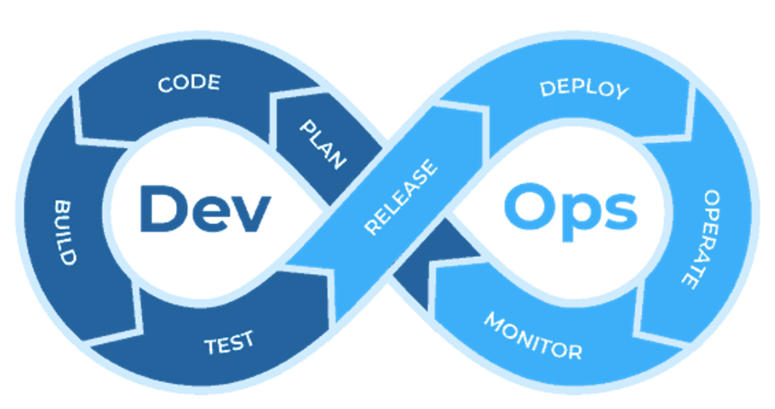

# Was ist DevOps

Zusammenarbeit und Kommunikation
•	Entwickler und Admins arbeiten eng zusammen
•	Gemeinsame Verantwortung für den gesamten Lebenszyklus der Software

Automatisierung
•	Möglichst viele wiederkehrende Aufgaben werden automatisiert
•	Reduziert menschliche Fehler und beschleunigt Prozesse

Kontinuierliche Integration und kontinuierliche Bereitstellung (CI/CD)
•	Codeänderungen werden regelmäßig integriert und automatisiert getestet
•	Neue Versionen werden automatisch bereitgestellt

Monitoring und Feedback
•	Laufende Überwachung der Anwendungen und Infrastruktur
•	Schnelles Feedback bei Fehlern oder Problemen

# DevOps Lifecycle Phasen
        
**Plan:** Anforderungen und Funktionen definieren
**Code:** Software entwickeln und überprüfen
**Build:** Code kompilieren und verpacken
**Test:** Automatisierte Tests zur Qualitätssicherung durchführen
**Release:** Vorbereitung für die Bereitstellung
**Deploy:** Auslieferung in die Produktionsumgebung
**Operate:** Produktionssysteme warten und betreiben
**Monitor:** Leistung überwachen und Probleme identifizieren

# Vertiefung

## Was ist DevOps und wie hat sich dieses Konzept in der IT-Branche entwickelt?

* **Definition:** DevOps ist ein Ansatz, der **Entwicklung (Development) und Betrieb (Operations)** enger verzahnt, um Software schneller, zuverlässiger und kontinuierlich bereitzustellen.
* **Entwicklung:**

  * Früher: Klare Trennung zwischen Entwicklern (Code schreiben) und Betrieb (Systeme am Laufen halten). Das führte oft zu Konflikten („Works on my machine“-Problem).
  * Heute: Mit steigender **Komplexität, Cloud-Technologien und agilen Methoden** entstand DevOps als Reaktion, um **Silos aufzubrechen** und **Time-to-Market** zu verkürzen.

## Welche grundlegenden Prinzipien und Praktiken bilden das Fundament von DevOps?

* **Kollaboration** – enge Zusammenarbeit zwischen Dev, Ops und weiteren Teams (QA, Security).
* **Automatisierung** – Tests, Builds, Deployments, Infrastruktur als Code.
* **Continuous Integration & Delivery (CI/CD)** – schneller, sicherer Codefluss.
* **Monitoring & Feedback** – kontinuierliche Überwachung, schnelle Rückkopplung.
* **Iteratives Lernen** – kleine Änderungen, schnelles Experimentieren.

## Wie unterscheidet sich DevOps von traditionellen IT-Ansätzen und welche konkreten Vorteile entstehen daraus?

* **Traditionell:**

  * Entwicklung und Betrieb arbeiten getrennt.
  * Lange Release-Zyklen (Monate oder Jahre).
  * Manuelle Tests und Deployments.
* **DevOps:**

  * Gemeinsame Verantwortung.
  * Kurze, häufige Releases (täglich/wöchentlich).
  * Hoher Automatisierungsgrad.
* **Vorteile:**

  * Schnellere Markteinführung.
  * Höhere Qualität und Stabilität.
  * Bessere Zusammenarbeit & Motivation im Team.
  * Skalierbare Prozesse (Cloud, Container).

## Was bedeuten die Begriffe "Continuous Integration" und "Continuous Delivery/Deployment" und wie funktionieren diese Prozesse in der Praxis?

* **Continuous Integration (CI):**

  * Entwickler integrieren ihren Code regelmäßig (mehrmals täglich) in ein gemeinsames Repository.
  * Jeder Commit wird automatisch gebaut, getestet und validiert.
  * Ziel: Fehler früh erkennen.
* **Continuous Delivery (CD):**

  * Der Code wird so vorbereitet, dass er jederzeit in Produktion gehen kann.
  * Deployment erfolgt noch manuell, aber auf Knopfdruck.
* **Continuous Deployment (CD):**

  * Automatischer Rollout neuer Versionen direkt nach erfolgreichen Tests.
  * Ziel: Vollständige Automatisierung der Auslieferung.

## Welche kulturellen Veränderungen sind für eine erfolgreiche DevOps-Transformation notwendig?

* **Vertrauen & Verantwortung teilen** – alle tragen gemeinsam Verantwortung für das Produkt.
* **Fehlerkultur** – Fehler gelten als Lernchance, nicht als Schuldfrage.
* **Offene Kommunikation** – transparente Prozesse und Wissensteilung.
* **Kundenorientierung** – Fokus auf Nutzen und schnelle Reaktion auf Feedback.

## Welche Tool-Kategorien und beispielhafte Technologien werden in modernen DevOps-Umgebungen eingesetzt?

* **Versionsverwaltung:** Git (GitHub, GitLab, Bitbucket).
* **CI/CD-Pipelines:** Jenkins, GitLab CI/CD, GitHub Actions, Azure DevOps.
* **Container & Orchestrierung:** Docker, Kubernetes, OpenShift.
* **Infrastructure as Code (IaC):** Terraform, Ansible, Puppet, Chef.
* **Monitoring & Logging:** Prometheus, Grafana, ELK-Stack, Splunk.
* **Collaboration:** Slack, Teams, Jira, Confluence.

## Welche Herausforderungen können bei der Einführung von DevOps auftreten und wie können diese bewältigt werden?

* **Kultureller Widerstand** – Teams halten an alten Strukturen fest → *Lösung:* Schulungen, Change-Management, klare Kommunikation.
* **Tool-Sprawl** – zu viele Tools ohne klare Integration → *Lösung:* Standards setzen, zentrale Plattform wählen.
* **Sicherheitsbedenken** – Automatisierung kann Angriffsflächen öffnen → *Lösung:* DevSecOps (Sicherheit in den Prozess integrieren).
* **Komplexität der Umstellung** – alte Systeme, fehlende Cloud-Nutzung → *Lösung:* Schrittweise Einführung, Pilotprojekte, kleine Erfolge sichtbar machen.

