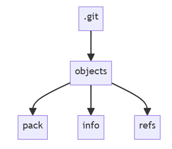

# Der .git-Ordner

## Zweck
Der `.git`-Ordner ist das **Herzstück eines Git-Repositories**.  
Er speichert alle Informationen zur **Versionsverwaltung**, damit du:
- Änderungen nachverfolgen  
- frühere Versionen wiederherstellen  
- mit anderen zusammenarbeiten kannst

## Inhalte
Wichtige Bestandteile im `.git`-Ordner:

- **objects** → speichert Commits, Dateien und Verzeichnisstrukturen  
- **refs** → Verweise auf Branches, Tags und Remotes  
- **HEAD** → zeigt auf den aktuell ausgecheckten Branch/Commit  
- **index** → *Staging Area* für Änderungen vor dem Commit  
- **config** → Einstellungen (Benutzer, Remotes, etc.)  
- **hooks** → Skripte zur Automatisierung (z. B. pre-commit)  
- **logs** → Historie von Branch- und Referenzänderungen  



## Rolle
Der `.git`-Ordner ermöglicht Git:
- **Änderungen zu tracken**  
- **Branches/Tags zu verwalten**  
- **den Repo-Zustand zu speichern**  
- **Workflows zu automatisieren**  

## Kurzfazit
Der `.git`-Ordner ist die **Basis jedes Git-Repositories** und macht Versionierung, Zusammenarbeit und Projektverwaltung möglich.

# Die .gitignore-Datei

Die `.gitignore`-Datei legt fest, **welche Dateien und Ordner Git ignorieren soll**  
(d. h. sie werden **nicht versioniert**).

# Git Init

## Was ist `git init`?
`git init` erstellt ein **neues Git-Repository**.  
Dabei legt Git im Projektverzeichnis den versteckten **.git-Ordner** an, in dem alle nötigen Dateien und Strukturen für die Versionskontrolle gespeichert werden.

## Warum `git init`?
- **Versionskontrolle** – Änderungen nachverfolgen, vergleichen, zurücksetzen  
- **Zusammenarbeit** – Projekte mit anderen teilen (GitHub, GitLab, etc.)  
- **Backup** – jeder Commit ist ein sicherer Snapshot  

## Wichtige Optionen
- `git init <verzeichnis>` → Repository im angegebenen Ordner erstellen  
- `git init --bare` → Bare-Repository ohne Arbeitsverzeichnis (z. B. zentraler Server)  
- `git init --quiet` → ohne unnötige Ausgaben  
- `git init --shared` → gemeinsames Repository für mehrere Nutzer  

## Git Init vs. Git Clone
- **git init** → erstellt ein komplett neues Repository  
- **git clone** → kopiert ein bestehendes Remote-Repository lokal  

## Bare Repositories
- enthalten **kein Arbeitsverzeichnis**  
- dienen als **zentrale Repos** für Push/Pull  

Befehl:  
```bash
git init --bare <repo-name>
```

# Änderungen aus Remote-Repositories holen

## Übersicht
- **clone** → komplettes Repository kopieren  
- **fetch** → neue Daten vom Remote laden (ohne zu mergen)  
- **merge** → Änderungen zusammenführen  
- **pull** → Kombination aus *fetch* + *merge*

## Repository klonen

```bash
git clone https://github.com/USERNAME/REPOSITORY.git
```

* erstellt neuen Ordner
* richtet ein Git-Repository ein
* legt Remote `origin` an
* lädt Dateien & Commits herunter
* checkt den Standard-Branch aus
* legt Remote-Tracking-Branches wie `origin/main` an

## Änderungen fetchen

```bash
git fetch REMOTE-NAME
```

* holt **neue Branches/Tags** vom Remote
* integriert sie **nicht automatisch** in deine Branches

## Änderungen mergen

```bash
git merge REMOTE-NAME/BRANCH-NAME
```

* kombiniert Remote-Änderungen mit deinem lokalen Branch

## Änderungen pullen

```bash
git pull REMOTE-NAME BRANCH-NAME
```

* entspricht `git fetch` + `git merge`
* lokale Arbeit vorher committen, um Konflikte zu vermeiden
* bei Problemen:

```bash
git merge --abort
```

## Kurzfazit

* **clone**: komplette Kopie holen
* **fetch**: nur Updates holen
* **merge**: Änderungen zusammenführen
* **pull**: Updates holen & direkt mergen

# Änderungen verwalten mit Git

## `git add` – Änderungen vormerken
- legt bearbeitete Dateien in der **Staging Area** ab  
- ohne `git add` weiß Git nicht, was im nächsten Commit landen soll
  
Beispiele:  

```bash
git add app.js        # einzelne Datei
git add .             # alle geänderten Dateien (außer .gitignore)
```

## `git commit` – Änderungen speichern

* wandelt Inhalte aus der Staging Area in einen **Snapshot** um
* jeder Commit erhält eine eindeutige **Hash-ID**
* Beispiel:

```bash
git commit -m "Add feature: input validation"
```

* Commit-Nachrichten sollten **aussagekräftig** sein
* mit `git log` sieht man Historie, Hashes und Autor\:innen

## `git push` – Änderungen teilen

* überträgt lokale Commits ins **Remote-Repository**
* Standard:

```bash
git push origin main
```

* `origin` = Standardname des Remotes, `main` = Branch
* danach können andere per `git pull` deine Änderungen übernehmen

## Beispiel-Workflow

```bash
git status               # Status prüfen
git add app.js styles.css # Änderungen vormerken
git commit -m "Improve UI and validation"
git push origin main      # Änderungen hochladen
```

## Best Practices

* **häufig committen** (kleine Einheiten)
* **klare Commit-Messages** schreiben
* **Feature-Branches** statt direkt auf `main`
* **regelmäßig Status prüfen** mit `git status`

## Erweiterung: Graphite CLI

* vereinfacht `add + commit + push` mit einem einzigen Befehl:

```bash
gt create --all --message "feat: Implement new API"
gt submit
```

* unterstützt **PR-Stacking**, um große Features in kleinere Pull Requests aufzuteilen
* Befehle wie `gt sync` halten Branches aktuell

## Kurzfazit

Die Kombination aus **`git add` → `git commit` → `git push`** bildet den Kern-Workflow in Git.
Graphite CLI baut darauf auf und bietet erweiterte Features für effiziente Zusammenarbeit.

# Git Push – Änderungen ins Remote übertragen

## Grundbefehl
```bash
git push REMOTE-NAME BRANCH-NAME
````

Beispiel:

```bash
git push origin main
```

➡️ überträgt lokale Commits auf den angegebenen Remote-Branch

## Branches umbenennen

```bash
git push REMOTE LOCAL-BRANCH:REMOTE-BRANCH
```

➡️ pusht `LOCAL-BRANCH`, benennt ihn im Remote in `REMOTE-BRANCH` um

## Häufige Probleme

* **non-fast-forward Fehler**: Remote ist neuer als dein Branch → erst `git fetch`, dann mergen oder rebasen
* **Push blockiert (Secrets)**: GitHub schützt vor versehentlichen API-Keys o. Ä.

  * Lösung: Geheimnisse entfernen oder explizit Push erlauben

## Tags pushen

* Einzelnes Tag:

```bash
git push origin TAG-NAME
```

* Alle Tags:

```bash
git push origin --tags
```

## Remote-Branch/Tag löschen

```bash
git push origin :BRANCH-NAME
```

➡️ durch den Doppelpunkt wird der Branch im Remote gelöscht

## Remotes & Forks

* Standard-Remote = `origin`
* Zusätzliches Remote hinzufügen, z. B. Original-Repo (`upstream`):

```bash
git remote add upstream URL
git fetch upstream
```

➡️ lädt Branches und Updates vom ursprünglichen Repository

## Kurzfazit

* **`git push`** = lokale Commits hochladen
* unterstützt auch **Tags**, **Branch-Umbenennung** und **Löschen**
* bei Konflikten immer erst **`git fetch`** ausführen
* für Forks zusätzlich `upstream` als Remote einrichten

